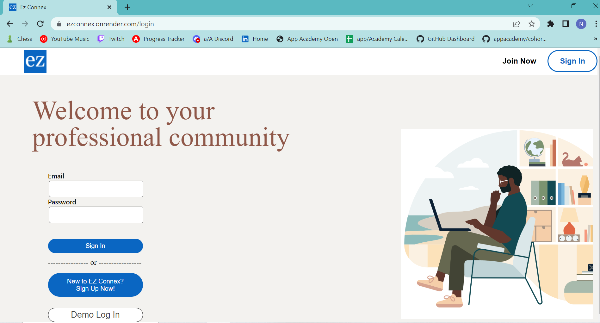
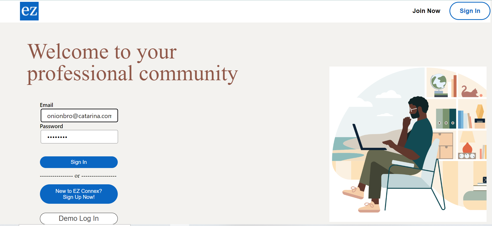
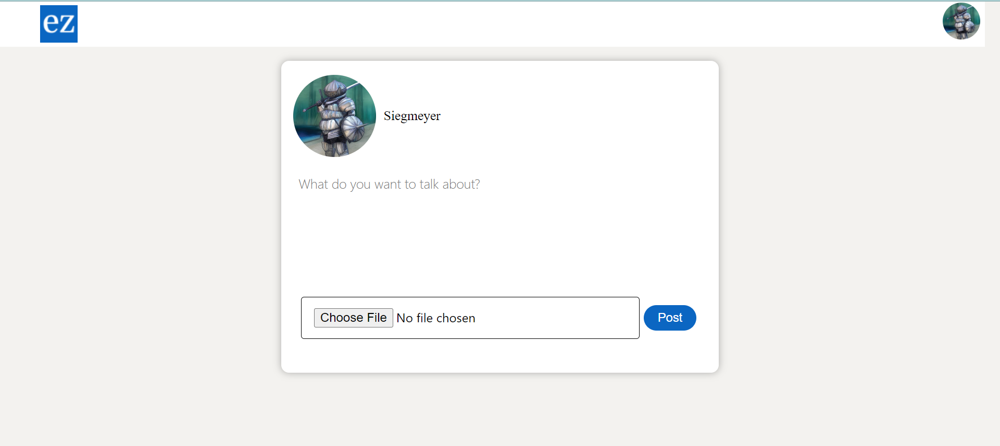
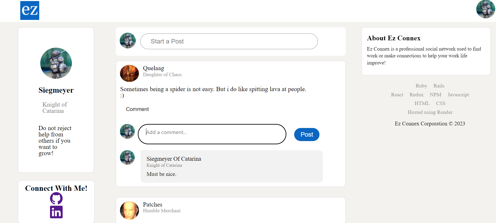
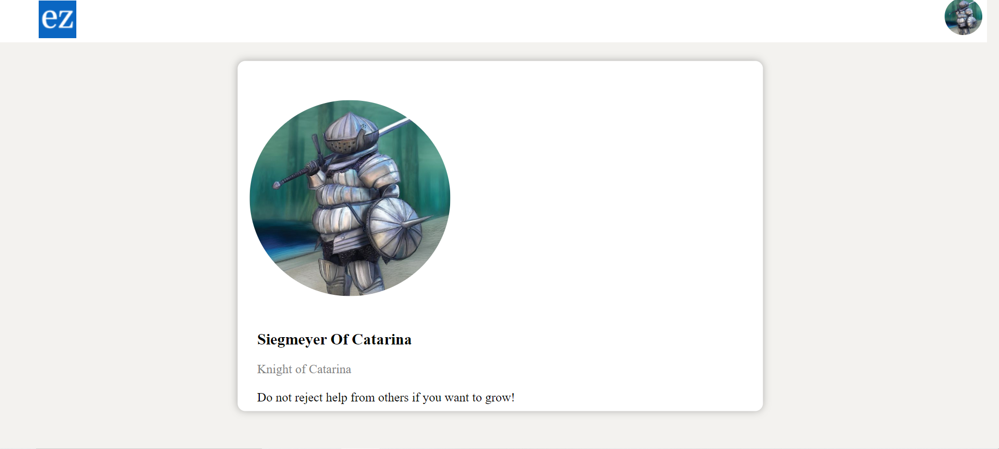

# Welcome to Ez Connex!

Feel free to check out my live site! [Live Site Link](https://ezconnex.onrender.com/)

# Background

Ez Connex is a professional social media web application to help build connections and find work.

# Functionality & MVPs
Ez Connex comes with  core features:

1. Hosting on Render.com
    - Visit [Ez Connex](https://ezconnex.onrender.com/) for a live demo
     

2. User Authentication & Demo User Account
    - Users can create their own account, login to an existing account, or use a demo user login
    

3. Users can create Posts
    - Posts can consist of text and a photo
    - Posts can be edited or deleted 
    

4. Users can comment on posts
    - Users can leave comments on posts
    - Comments can be updated or deleted 
    

5. User Profile Page
    - Users have a personal profile page displaying their information.
    

# Technologies, Libraries, APIs

<code></code>
<code></code>
<code></code>
<code></code>
<code></code>
<code></code>
<code></code>
<code></code>
<code></code>
<code></code>
<code></code>
<code></code>

# Developer
- Nick Gentry
